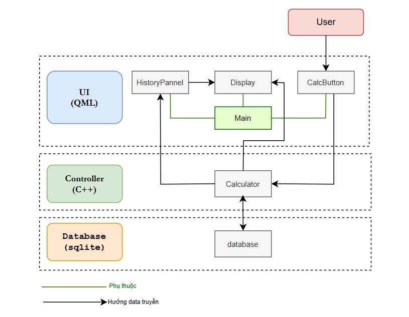
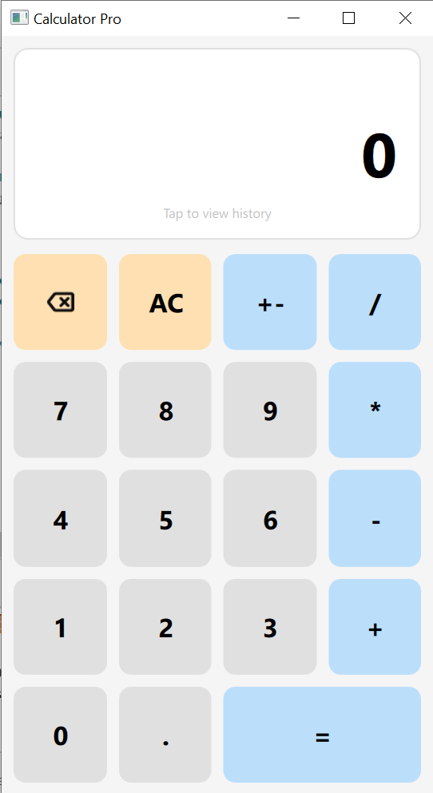
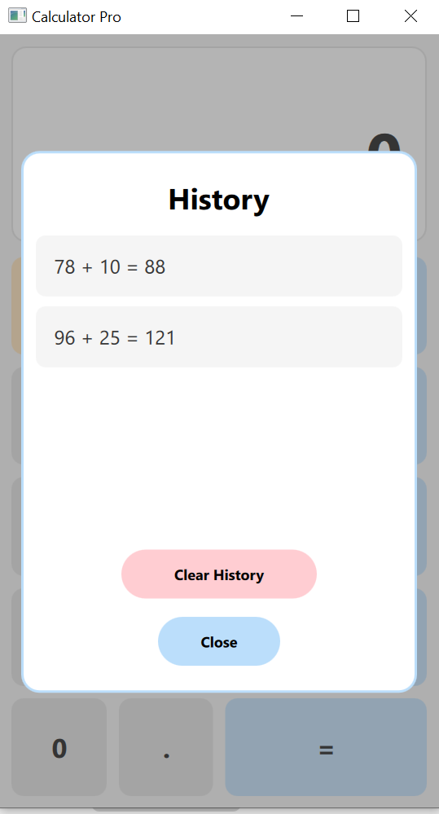

# Calculator Pro
Calculator Pro là một ứng dụng máy tính hiện đại được xây dựng bằng framework Qt 6, kết hợp sức mạnh xử lý logic của C++ và giao diện linh hoạt của QML. Ứng dụng hỗ trợ lưu trữ lịch sử tính toán thời gian thực bằng cơ sở dữ liệu SQLite.

## Tính năng
- Tính toán cơ bản.
- Hỗ trợ việc lưu trữ lịch sử các phép tính.

## Kiến trúc phần mềm

  

## Ứng dụng
### Giao diện chính

  

### Quản lí lịch sử

  

## Công nghê
- Ngôn ngữ: C++, QML
- Framework: Qt 6.10.2
- database: sqlite
- Buildsystem: CMake
